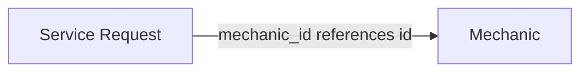

# Mini Mechanic Service API

A RESTful backend API for a mechanic-service platform where customers can view mechanics and create service requests for mechanic services.

## Tech Stack

* Python
* Django
* Django REST Framework
* SQLite

## Project Setup

### 1. Clone the repository

```bash
git clone https://github.com/mayuripaliwal/mechanic-service
cd mechanic-service
```

### 2. Create and activate a virtual environment

#### Windows

```bash
python -m venv .venv
.venv\Scripts\activate
```

#### macOS / Linux

```bash
python3 -m venv .venv
source .venv/bin/activate
```

### 3. Install dependencies

```bash
pip install -r requirements.txt
```

### 4. Apply database migrations

```bash
python manage.py migrate
```

### 5. Start the development server

```bash
python manage.py runserver
```

The API will be available at:

```text
http://127.0.0.1:8000/
```

---

## Database / Model Setup

The application uses SQLite as the database.

### Mechanic

The `Mechanic` model stores information about mechanics and the services they provide.

| Field      | Type         | Description                              |
| ---------- | ------------ | ---------------------------------------- |
| `id`       | BigAutoField | Primary key                              |
| `name`     | CharField    | Mechanic name                            |
| `phone`    | CharField    | Mechanic phone number                    |
| `location` | CharField    | Mechanic location                        |
| `rating`   | DecimalField | Rating between 0.0 and 5.0               |
| `is_open`  | BooleanField | Whether the mechanic is currently open   |
| `services` | JSONField    | List of services offered by the mechanic |

### ServiceRequest

The `ServiceRequest` model stores customer service requests.

| Field                 | Type          | Description                                |
| --------------------- | ------------- | ------------------------------------------ |
| `id`                  | BigAutoField  | Primary key                                |
| `customer_name`       | CharField     | Customer name                              |
| `customer_phone`      | CharField     | Customer phone number                      |
| `vehicle_number`      | CharField     | Vehicle registration number                |
| `mechanic_id`            | ForeignKey    | Mechanic associated with the request       |
| `service`             | CharField     | Requested service                          |
| `problem_description` | TextField     | Description of the vehicle problem         |
| `status`              | CharField     | Request status, defaults to `PENDING`      |
| `created_at`          | DateTimeField | Automatically generated creation timestamp |

> `mechanics_servicerequest.mechanic` is a foreign key referencing `mechanics_mechanic.id`

### Relationship

Each service request is associated with one mechanic through the `mechanic_id` foreign key, which references the `id` primary key of the mechanic.



---

## API Documentation

### Mechanic APIs

#### Get All Mechanics

```http
GET /mechanics/
```

Returns all mechanics.

**Response: `200 OK`**

```json
[
    {
        "id": 1,
        "name": "ABC Motors",
        "phone": "9876543210",
        "location": "Delhi",
        "rating": "4.5",
        "is_open": true,
        "services": [
            "Oil Change",
            "Brake Repair"
        ]
    }
]
```

---

#### Get Mechanic by ID

```http
GET /mechanics/<id>/
```

Returns the mechanic with the specified ID.

**Response: `200 OK`**

```json
{
    "id": 1,
    "name": "ABC Motors",
    "phone": "9876543210",
    "location": "Delhi",
    "rating": "4.5",
    "is_open": true,
    "services": [
        "Oil Change",
        "Brake Repair"
    ]
}
```

If the mechanic does not exist:

```json
404 Not Found

{
    "detail": "Mechanic with id 1 does not exist."
}
```
---

#### Add a Mechanic

```http
POST /mechanics/
```

**Request**

```json
{
    "name": "ABC Motors",
    "phone": "9876543210",
    "location": "Delhi",
    "rating": "4.5",
    "is_open": true,
    "services": [
        "Oil Change",
        "Brake Repair"
    ]
}
```

**Response: `201 Created`**

```json
{
    "id": 1,
    "name": "ABC Motors",
    "phone": "9876543210",
    "location": "Delhi",
    "rating": "4.5",
    "is_open": true,
    "services": [
        "Oil Change",
        "Brake Repair"
    ]
}
```

---

#### Update a Mechanic

```http
PUT /mechanics/<id>/
```

Replaces the mechanic details.

**Request**

```json
{
    "name": "ABC Motors",
    "phone": "9876543210",
    "location": "Noida",
    "rating": "4.8",
    "is_open": true,
    "services": [
        "Oil Change",
        "Brake Repair",
        "Engine Repair"
    ]
}
```

**Response: `200 OK`**

Returns the updated mechanic.

---

#### Partially Update a Mechanic

```http
PATCH /mechanics/<id>/
```

Updates only the fields provided in the request.

**Request**

```json
{
    "rating": "4.8",
    "is_open": false
}
```

**Response: `200 OK`**

Returns the updated mechanic.

---

#### Delete a Mechanic

```http
DELETE /mechanics/<id>/
```

Deletes the mechanic.

**Response: `204 No Content`**

If the mechanic does not exist:

```http
404 Not Found
```

---

## Service Request API

### Create a Service Request

```http
POST /service-requests/
```

Creates a new service request for an existing mechanic.

**Request**

```json
{
    "customer_name": "Mayuri",
    "customer_phone": "9876543210",
    "vehicle_number": "DL01AB1234",
    "mechanic_id": 1,
    "service": "Oil Change",
    "problem_description": "Engine making noise"
}
```

**Response: `201 Created`**

```json
{
    "id": 1,
    "customer_name": "Mayuri",
    "customer_phone": "9876543210",
    "vehicle_number": "DL01AB1234",
    "service": "Oil Change",
    "problem_description": "Engine making noise",
    "status": "PENDING",
    "created_at": "2026-09-02T03:38:58.251142Z",
    "mechanic_id": 1
}
```

The `status` is automatically set to `PENDING`, and `created_at` is automatically generated when the request is created.

---

## Validation & Error Handling

The API validates incoming data and returns appropriate HTTP status codes with meaningful error messages.

### Required Fields

Missing required fields result in:

```http
400 Bad Request
```

Example:

```json
{
    "customer_name": [
        "This field is required."
    ]
}
```

### Invalid Phone Number

Customer phone numbers must contain exactly 10 digits.

Example:

```json
{
    "customer_phone": "98765abc"
}
```

Response:

```json
400 Bad Request
{
    "customer_phone": [
        "Customer phone number must be a 10-digit number."
    ]
}
```

### Invalid Vehicle Number

Vehicle numbers are validated against the following simplified format:

```text
XX00XX0000
```

Example:

```text
DL01AB1234
```

Invalid vehicle numbers result in:

```json
400 Bad Request

{
    "vehicle_number": [
        "Vehicle number must be in the format: XX00XX0000 (e.g., MH12AB1234)."
    ]
}
```

### Invalid Mechanic ID

The supplied `mechanic_id` must refer to an existing mechanic.

If the mechanic does not exist:

```http
400 Bad Request
```

```json
{
    "mechanic_id": [
        "Mechanic with the given id does not exist."
    ]
}
```

Invalid mechanic ID types are also rejected by the serializer.

### Invalid Service

The requested service must be provided by the selected mechanic.

If the selected mechanic does not provide the requested service:

```http
400 Bad Request
```

Example error:

```json
{
    "service": [
        "This service is not provided by the selected mechanic."
    ]
}
```

### Invalid Mechanic Rating

Mechanic ratings must be between `0.0` and `5.0`.

```text
0.0 <= rating <= 5.0
```

Values outside this range result in:

```http
400 Bad Request
```

---

## Vehicle Number Format

This implementation uses a simplified vehicle registration format:

```text
XX00XX0000
```

Examples:

```text
DL01AB1234
MH12AB1234
```

> Note: The validation is intentionally simplified and does not cover specialized registration formats such as BH-series registrations.
