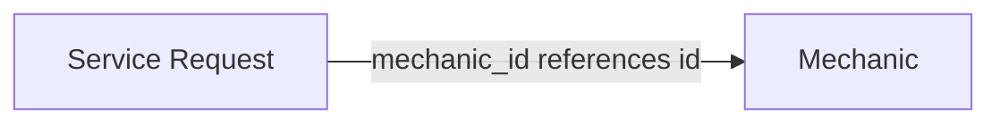

# Mini Mechanic Service API

A RESTful backend API for a mechanic-service platform where customers can view mechanics and create service requests for mechanic services.

## Tech Stack

* Python
* Django
* Django REST Framework
* SQLite
* pytest
* pytest-django

---

## Project Setup

### 1. Clone the repository

```bash
git clone https://github.com/mayuripaliwal/mechanic-service

cd mechanic-service
```

### 2. Create and activate a virtual environment

#### Windows

```bash
python -m venv .venv
.venv\Scripts\activate
```

#### macOS / Linux

```bash
python3 -m venv .venv
source .venv/bin/activate
```

### 3. Install dependencies

```bash
pip install -r requirements.txt
```

### 4. Apply database migrations

```bash
python manage.py migrate
```

### 5. Start the development server

```bash
python manage.py runserver
```

API documentation will be available at:

```text
http://127.0.0.1:8000/docs
```

The API will be available at:

```text
http://127.0.0.1:8000/
```


---

## Database / Model Setup

The application uses SQLite as the database.

### Mechanic

The `Mechanic` model stores information about mechanics and the services they provide.

| Field      | Type         | Description                              |
| ---------- | ------------ | ---------------------------------------- |
| `id`       | BigAutoField | Primary key                              |
| `name`     | CharField    | Mechanic name                            |
| `phone`    | CharField    | Mechanic phone number                    |
| `location` | CharField    | Mechanic location                        |
| `rating`   | DecimalField | Rating between 0.0 and 5.0               |
| `is_open`  | BooleanField | Whether the mechanic is currently open   |
| `services` | JSONField    | List of services offered by the mechanic |

### ServiceRequest

The `ServiceRequest` model stores customer service requests.

| Field                 | Type          | Description                                |
| --------------------- | ------------- | ------------------------------------------ |
| `id`                  | BigAutoField  | Primary key                                |
| `customer_name`       | CharField     | Customer name                              |
| `customer_phone`      | CharField     | Customer phone number                      |
| `vehicle_number`      | CharField     | Vehicle registration number                |
| `mechanic_id`            | ForeignKey    | Mechanic associated with the request       |
| `service`             | CharField     | Requested service                          |
| `problem_description` | TextField     | Description of the vehicle problem         |
| `status`              | CharField     | Request status, defaults to `PENDING`      |
| `created_at`          | DateTimeField | Automatically generated creation timestamp |

> The `ServiceRequest.mechanic_id` field creates a foreign key relationship to `Mechanic`.



## API Documentation

### Mechanic APIs

| Method | Endpoint | Description |
|---|---|---|
| GET | `/mechanics/` | Get all mechanics |
| POST | `/mechanics/` | Create a new mechanic |
| GET | `/mechanics/<id>/` | Get a mechanic by ID |
| PUT | `/mechanics/<id>/` | Replace a mechanic |
| PATCH | `/mechanics/<id>/` | Partially update a mechanic |
| DELETE | `/mechanics/<id>/` | Delete a mechanic |

### Service Request API

| Method | Endpoint | Description |
|---|---|---|
| POST | `/service-requests/` | Create a new service request |

### Service Request Fields

| Field | Required | Description |
|---|---|---|
| `customer_name` | Yes | Customer's name |
| `customer_phone` | Yes | 10-digit customer phone number |
| `vehicle_number` | Yes | Vehicle registration number |
| `mechanic_id` | Yes | ID of the selected mechanic |
| `service` | Yes | Service requested from the mechanic |
| `problem_description` | Yes | Description of the vehicle problem |

A newly created service request automatically receives a `PENDING` status and a `created_at` timestamp.

---

## Testing

The project uses `pytest` and `pytest-django` for automated API testing.

Run the test suite with:

```bash
pytest
```

The test suite covers:

* Mechanic CRUD operations
* Service request creation
* Required field validation
* Invalid phone numbers
* Invalid vehicle numbers
* Invalid mechanic IDs
* Nonexistent mechanics
* Invalid services
* Invalid mechanic ratings
* Appropriate HTTP status codes and error responses

## Engineering Trade-offs

Due to the time constraints, I prioritized the core functionality, testing, and documentation.

- **Database:** Used SQLite for faster setup. For a production system, I would prefer PostgreSQL.

- **Testing:** Used `pytest` based on my familiarity with it and focused on testing the core APIs and validation cases.

- **API Documentation:** Added Swagger/OpenAPI to make the API easier to understand and test.

- **Vehicle Validation:** Supported common vehicle number formats instead of covering specialized formats such as BH-series registrations.

- **Scope:** Prioritized core APIs, validation, error handling, tests, and documentation over additional features.
